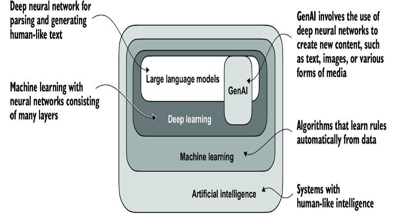

# Lecture 2: Large Language Models (LLM) Basics
> Reference Book : Build a Large Language Model (From Scratch) Book by Sebastian Raschka

> Source : https://www.youtube.com/watch?v=3dWzNZXA8DY&list=PLPTV0NXA_ZSgsLAr8YCgCwhPIJNNtexWu&index=2

An LLM is a neural network designed to understand, generate, and respond to human-like text. These models are deep neural networks trained on massive amounts of text data, sometimes encompassing large portions of the entire publicly available text on the internet

They are called "large" because they have **billions (or even trillions) of parameters** — the internal settings that the model adjusts as it learns from data.

LLMs utilize an architecture called the **transformer**, which allows them to pay selective attention to different parts of the input when making predictions, making them especially adept at handling the nuances and complexities of human language.

Refer : [Attention Is All You Need](https://proceedings.neurips.cc/paper_files/paper/2017/file/3f5ee243547dee91fbd053c1c4a845aa-Paper.pdf) - A Research Paper published by researchers at Google which talks about Transformer Architecture.

### 📦 Examples:
- **GPT**
- **BERT**
- **Claude**
- **LLaMA**
- **Gemini**

### LLMs vs GenAI vs DL vs ML vs AI
