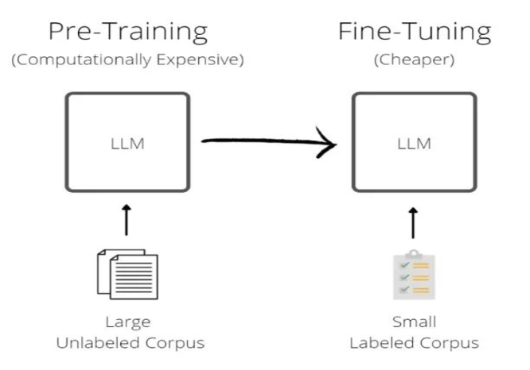

# Stages of building and using LLMs

> Book Chapter: 1.3 Stages of Building and using LLMs
> Source: https://youtu.be/-bsa3fCNGg4?si=l_Hq33-RO4mjBfJK

The general process of creating an LLM includes pretraining and fine-tuning

Creating an LLM = Pretraining + Finetuning

**Pretraining**
Pretraining is the initial phase of training the model, where it learns to understand the language in general.
- Here, the model is trained on massive amounts of text from the internet.
- It learns to predict the **next word** in the sentence
- No labels or human annotations are needed - it's self-supervised

Example:
If it sees:
> “The Eiffel Tower is located in ___.”

It learns to predict "Paris" just from patterns in data. By doing this billions of times, it gets really good at understanding language, grammar, and facts

Creating an initial pretrained LLM, often called a **base** or **foundation model**. A typical example of such a model is the GPT3 model 

**Finetuning**

This is the second phase, where the pretrained model is adapted to a specific task or made safer, more helpful, or aligned with human expectations.

There are two types:

1. Task-Specific Finetuning:
Trained on labeled data for a particular job.

Example: Finetune GPT on medical documents to make it a medical assistant.

Common in enterprise use cases.

2. Instruction Finetuning / Alignment (like ChatGPT-style models):
Models are trained to follow instructions better.

Often includes **Reinforcement Learning from Human Feedback (RLHF)** — where humans rate or rank outputs, and the model learns from that.

.png)
