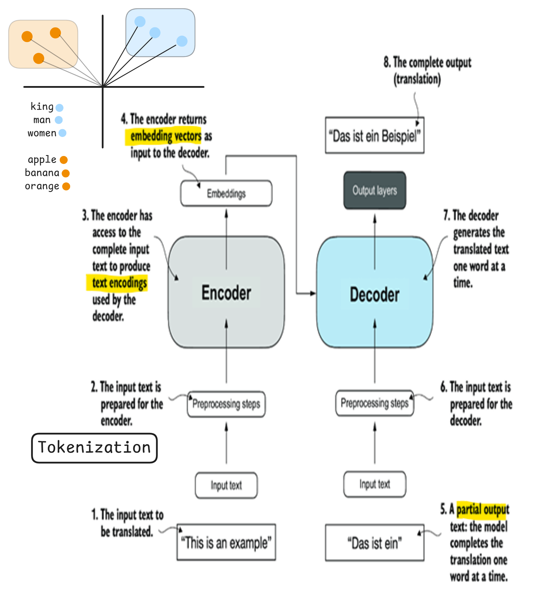
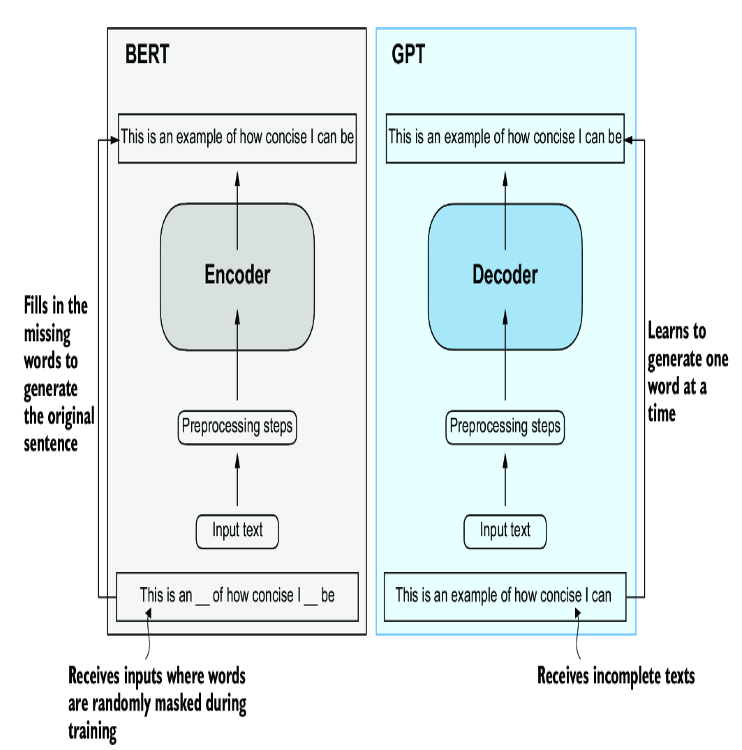

# Introducing the transformer architecture

Most modern LLMs rely on the transformer architecture, which is a deep neural network architecture introduced in the 2017 paper [“Attention Is All You Need”]( https://arxiv.org/abs/1706.03762). 

**Transformers** are a type of deep neural network architecture that use self-attention mechanisms to process input sequences in parallel. They were originally developed for machine translation—a task that involves converting a sentence from one language into another.

How They Work in Translation

1. The input sentence is first tokenized and embedded into numerical vectors.

2. Positional encodings are added to these embeddings to retain information about word order.

3. Multiple layers of self-attention allow the encoder to capture the relationships between all tokens in the sentence simultaneously, forming a rich, contextual representation.

4. The decoder receives the encoder’s output and, starting with a special start-of-sequence token, generates the translation one token at a time.

5. It uses self-attention to consider previously generated words and cross-attention to focus on the relevant parts of the encoder’s output.

6. Masking ensures that the decoder does not “see” future words during training, preserving the autoregressive nature of the generation

Today, the transformer architecture is the backbone of nearly all state-of-the-art large language models (LLMs) such as GPT, BERT, and T5. While originally designed for translation, their ability to capture long-range dependencies and model complex language patterns makes them suitable for a wide range of tasks

**GPT** and **BERT** are both transformer-based language models, but they are designed for very different purposes, and their architectures and training objectives reflect these differences:

### BERT (Bidirectional Encoder Representations from Transformers)

Encoder-Only: BERT uses only the encoder part of the transformer.

Bidirectional Processing: It reads the entire input simultaneously (both left and right context) which helps it understand the full context of each word.

Training Objective: BERT is trained with a masked language modeling (MLM) task. In MLM, some tokens are randomly masked, and the model learns to predict these missing tokens based on the surrounding context. This makes it particularly good at tasks requiring deep understanding, like question answering and sentiment analysis.

### GPT (Generative Pre-trained Transformer):

Decoder-Only: GPT uses only the decoder part of the transformer.

Unidirectional (Autoregressive) Processing: It processes text from left to right, predicting the next token based solely on the tokens that came before it.

Training Objective: GPT is trained with an autoregressive language modeling objective—learning to predict the next word in a sequence. This setup makes GPT exceptionally good at generating coherent and contextually relevant text, which is why it’s widely used for text generation, conversation, and creative writing.

## TRANSFORMERS VS. LLMS
Today’s LLMs are based on the transformer architecture. Hence, transformers and LLMs are terms that are often used synonymously in the literature. However, note that **not all transformers are LLMs** since transformers can also be used for computer vision. Also, **not all LLMs are transformers**, as there are LLMs based on recurrent and convolutional architectures.