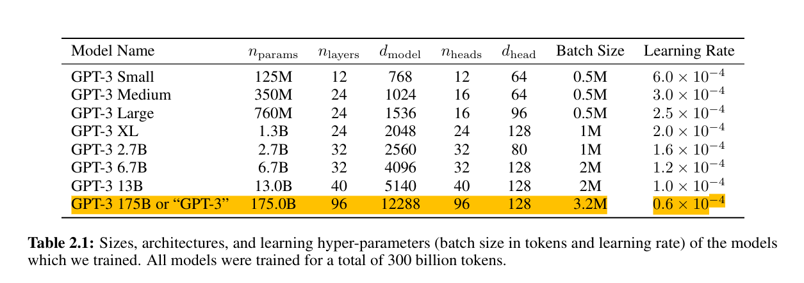
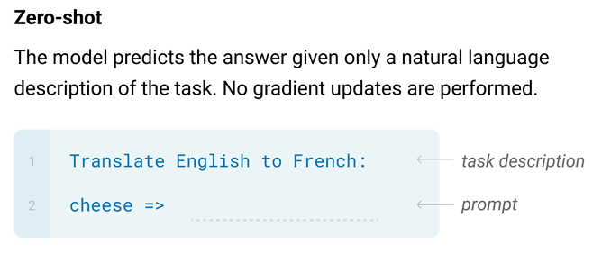
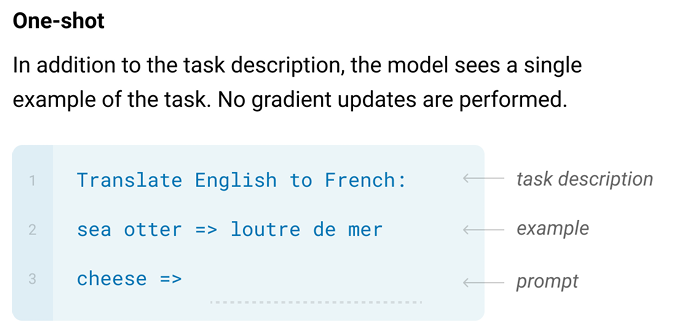
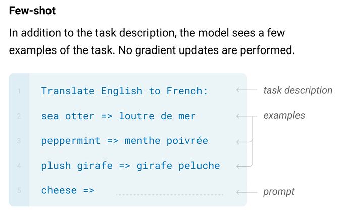
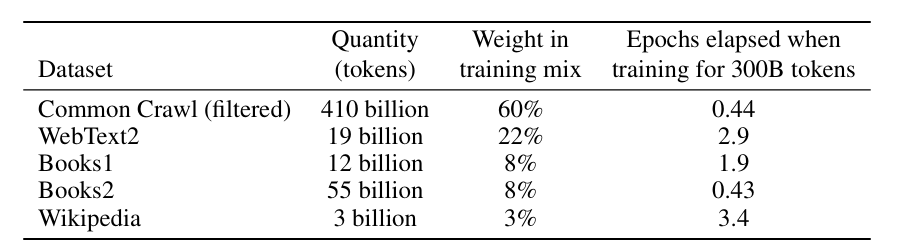
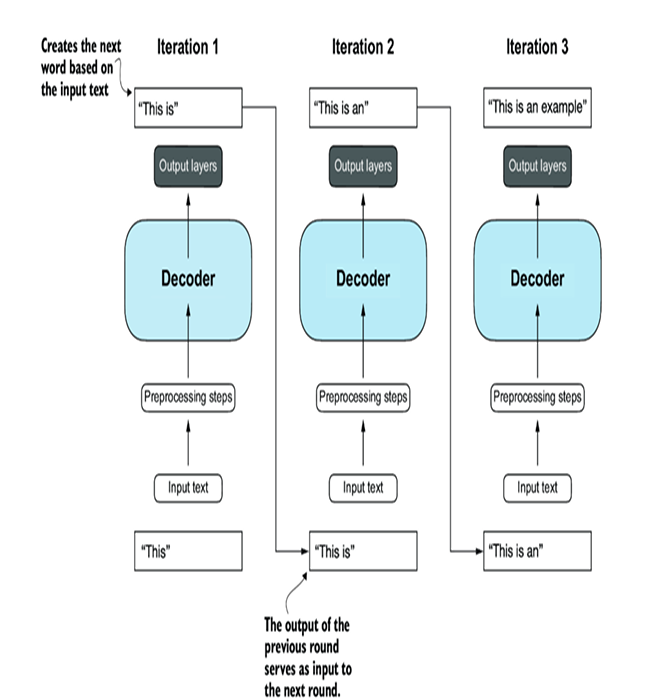

# A closer look at the GPT-3 architecture

## Research Papers

The evolution of today’s large language models (LLMs) is built upon a series of groundbreaking research papers.

1. Attention Mechanism and Early Translation Models:

> Bahdanau et al. (2014) introduced attention for neural machine translation in “Neural Machine Translation by Jointly Learning to Align and Translate.” This work laid the groundwork for understanding how models could focus on different parts of a sentence when translating.

2. The Transformer Architecture:

> Vaswani et al. (2017) published “Attention Is All You Need,” which introduced the transformer model—a purely attention-based architecture without recurrence. This paper is the cornerstone for nearly all modern LLMs

3. Bidirectional Models for Language Understanding:

> Devlin et al. (2018) introduced BERT (“BERT: Pre-training of Deep Bidirectional Transformers for Language Understanding”), which uses a bidirectional encoder to grasp context from both sides of each word. This approach revolutionized tasks like question answering and sentiment analysis.

4. Generative Models and the GPT Series:

> **Radford et al. (2018) presented GPT-1 in “Improving Language Understanding by Generative Pre-Training,” showing how an autoregressive model could be pre-trained on large text corpora.**

> **Radford et al. (2019) then introduced GPT-2 (“Language Models are Unsupervised Multitask Learners”), which significantly improved on text generation capabilities.**

> **Brown et al. (2020) took the next leap with GPT-3 (“Language Models are Few-Shot Learners”), demonstrating that scaling up the model and data could enable few-shot learning for a wide range of tasks.**

5. Unified Text-to-Text and Further Scaling:

> Raffel et al. (2019) in “Exploring the Limits of Transfer Learning with a Unified Text-to-Text Transformer” (T5) unified many NLP tasks under one framework, illustrating the versatility of the transformer architecture.

> Kaplan et al. (2020) provided “Scaling Laws for Neural Language Models,” which helped explain how increasing model size and training data correlates with improved performance.

6. Recent Advances:

> More recent work (e.g., the GPT-4 Technical Report) continues to build on these foundations, incorporating multimodal inputs and advanced reasoning capabilities.

---

In the paper ["Language Models are Unsupervised Multitask Learners"](https://cdn.openai.com/better-language-models/language_models_are_unsupervised_multitask_learners.pdf), OpenAI researchers have demonstrated that language models begin to learn these tasks without any explicit supervision when trained on a new dataset of millions of webpages

In the paper ["Language Models are Few-Shot Learners"](https://proceedings.neurips.cc/paper/2020/file/1457c0d6bfcb4967418bfb8ac142f64a-Paper.pdf), researchers demonstrated that by dramatically scaling up both the model size and the training data, it’s possible to develop a single model that can handle a wide variety of tasks without task-specific fine-tuning

**Few-Shot Learning**:
One of the most groundbreaking contributions is the model’s ability to perform "few-shot learning." Instead of the traditional fine-tuning approach, GPT-3 can be prompted with a few examples (or even no examples at all in some cases) to perform new tasks. This capability suggests that the model has learned a broad set of skills during its pre-training phase.

**Emergent Abilities**:
As the model scales, it exhibits emergent properties—capabilities that aren’t present in smaller models. This includes handling tasks like translation, question answering, arithmetic, and summarization effectively by leveraging its pre-trained knowledge.

---

## Zero Shot vs One Shot vs Few Shot Learners

---

## The pretraining dataset of the popular GPT-3 LLM

The Table displays the dataset used for GPT-3. The proportions column in the table sums up to 100% of the sampled data, adjusted for rounding errors. Although the subsets in the Number of Tokens column total 499 billion, the model was trained on only 300 billion tokens. The authors of the GPT-3 paper did not specify why the model was not trained on all 499 billion tokens

A token is a unit of text that a model reads and the number of tokens in a dataset is roughly equivalent to the number of words and punctuation characters in the text.

For context, consider the size of the CommonCrawl dataset, which alone consists of 410 billion tokens and requires about 570 GB of storage. In comparison, later iterations of models like GPT-3, such as Meta’s LLaMA, have expanded their training scope to include additional data sources like Arxiv research papers (92 GB) and StackExchange’s code-related Q&As (78 GB)

**Pretraining LLMs requires access to significant resources and is very expensive**. For example, the GPT-3 pretraining cost is estimated to be $4.6 million in terms of cloud computing credits

## Architecture of GPT-3

Compared to the original transformer architecture, the general GPT architecture is relatively simple.
Essentially, it’s just the decoder part without the encoder

Architecture of GPT-3 is significantly larger than the original transformer model. For instance, the original transformer repeated the encoder and decoder blocks six times. GPT-3 has 96 transformer layers and 175 billion parameters in total.

> An **autoregressive model** is a type of statistical model used to predict future values in a sequence by relying solely on its own previous values. In essence, it assumes that past behaviors influence future outcomes, making it particularly useful for time series analysis. In the context of natural language processing (NLP), autoregressive models generate text by predicting the next word in a sequence based on the preceding words. This means that each word is generated one at a time, with each new word conditioned on all the previous words. 

During training, GPT uses masked self-attention to ensure predictions for a word depend only on preceding words, preserving the autoregressive property.

