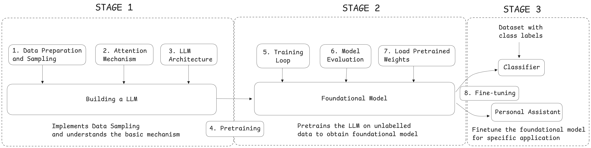

# Stages of Building a Large Language Model

The three main stages of coding an LLM are implementing the LLM architecture and data preparation process (stage 1), pretraining an LLM to create a foundation model (stage 2), and fine-tuning the foundation model to become a personal assistant or text classifier (stage 3).

In **stage 1**, we will learn about the fundamental data preprocessing steps and code the attention mechanism at the heart of every LLM

Next, in **stage 2**, we will learn how to code and pretrain a GPT-like LLM capable of generating new texts.

Pretraining an LLM from scratch is a sgnificant endeavor, demanding thousands to millions of dollas in computing costs for GPT-like models. Therefore, the focus of stage 2 is on implementing training for educational purposes using a small dataset.

In **stage 3**, we will take a pretrained LLM and fine-tune it to follow instructions such as answering queries or classifying texts—the most common tasks in many real-world applications and research

