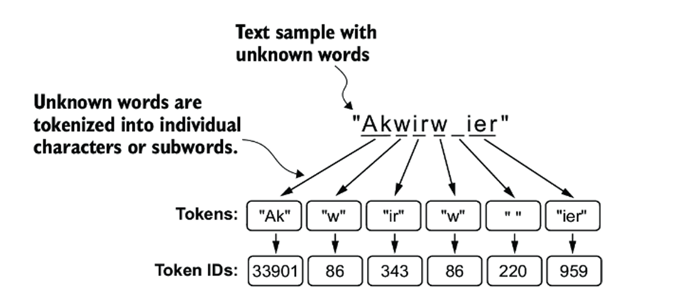

# Byte Pair Encoding

The BPE tokenizer was used to train LLMs such as GPT-2, GPT-3, and the original model used in ChatGPT

​Byte Pair Encoding (BPE) serves as a middle ground between word-based and character-based tokenization methods, aiming to balance vocabulary size and the ability to handle rare or unseen words.

The BPE tokenizer, which was used to train models such as GPT-2, GPT-3, and the original model used in ChatGPT, has a total vocabulary size of 50,257
The BPE tokenizer can handle any unknown word.

How does it achieve this?

The algorithm underlying BPE breaks down words that aren’t in its predefined vocabulary into smaller subword units or even individual characters, enabling it to handle out-of-vocabulary words. 

So, thanks to the BPE algorithm, if the tokenizer encounters an unfamiliar word during tokenization, it can represent it as a sequence of subword tokens or characters, as illustrated

## Example:

| Word       | Count |
|------------|------:|
| `old`  |     7 |
| `older`|     3 |
| `finest`|    9 |
| `lowest`|    4 |

__Preprocessing Step__: add the end of word marker `</w>`

## Dataset with End‑of‑Word Marker

| Word       | Count |
|------------|------:|
| `old</w>`  |     7 |
| `older</w>`|     3 |
| `finest</w>`|    9 |
| `lowest</w>`|    4 |

---

## Initial Character Counts

| Symbol | Count |
|:------:|------:|
| `</w>` |    23 |
| `o`    |    14 |
| `l`    |    14 |
| `d`    |    10 |
| `e`    |    16 |
| `r`    |     3 |
| `f`    |     9 |
| `i`    |     9 |
| `n`    |     9 |
| `s`    |    13 |
| `t`    |    13 |
| `w`    |     4 |

---

## Iteration 1: Merge `e`+`s` → `es`

| Symbol   | New Count    |
|:--------:|-------------:|
| `</w>`   |          23  |
| `o`      |          14  |
| `l`      |          14  |
| `d`      |          10  |
| `e`      | 16 − 13 = 3  |
| `r`      |           3  |
| `f`      |           9  |
| `i`      |           9  |
| `n`      |           9  |
| `s`      | 13 − 13 = 0  |
| `t`      |          13  |
| `w`      |           4  |
| **`es`** |       9 + 4 = 13 |

---

## Iteration 2: Merge `es`+`t` → `est`

| Symbol     | New Count     |
|:----------:|--------------:|
| `</w>`     |           23  |
| `o`        |           14  |
| `l`        |           14  |
| `d`        |           10  |
| `e`        | 16 − 13 = 3   |
| `r`        |            3  |
| `f`        |            9  |
| `i`        |            9  |
| `n`        |            9  |
| `s`        | 13 − 13 = 0   |
| `t`        | 13 − 13 = 0   |
| `w`        |            4  |
| `es`       | 13 − 13 = 0   |
| **`est`**  |           13  |

---

## Iteration 3: Merge `est`+`</w>` → `est</w>`

| Symbol        | New Count      |
|:-------------:|---------------:|
| `</w>`        | 23 − 13 = 10   |
| `o`           |           14   |
| `l`           |           14   |
| `d`           |           10   |
| `e`           | 16 − 13 = 3    |
| `r`           |            3   |
| `f`           |            9   |
| `i`           |            9   |
| `n`           |            9   |
| `s`           | 13 − 13 = 0    |
| `t`           | 13 − 13 = 0    |
| `w`           |            4   |
| `es`          | 13 − 13 = 0    |
| `est`         | 13 − 13 = 0    |
| **`est</w>`** |           13   |

---

## Iteration 4: Merge `o`+`l` → `ol`

| Symbol       | New Count      |
|:------------:|---------------:|
| `</w>`       |           10   |
| `o`          | 14 − 10 = 4    |
| `l`          | 14 − 10 = 4    |
| `d`          |           10   |
| `e`          | 16 − 13 = 3    |
| `r`          |            3   |
| `f`          |            9   |
| `i`          |            9   |
| `n`          |            9   |
| `s`          | 13 − 13 = 0    |
| `t`          | 13 − 13 = 0    |
| `w`          |            4   |
| `es`         | 13 − 13 = 0    |
| `est`        | 13 − 13 = 0    |
| `est</w>`    |           13   |
| **`ol`**     |           10   |

---

## Iteration 5: Merge `ol`+`d` → `old`

| Symbol    | New Count      |
|:---------:|---------------:|
| `</w>`    |           10   |
| `o`       | 14 − 10 = 4    |
| `l`       | 14 − 10 = 4    |
| `d`       | 10 − 10 = 0    |
| `e`       | 16 − 13 = 3    |
| `r`       |            3   |
| `f`       |            9   |
| `i`       |            9   |
| `n`       |            9   |
| `s`       | 13 − 13 = 0    |
| `t`       | 13 − 13 = 0    |
| `w`       |            4   |
| `es`      | 13 − 13 = 0    |
| `est`     | 13 − 13 = 0    |
| `est</w>` |           13   |
| `ol`      | 10 − 10 = 0    |
| **`old`** |           10   |

---

## Final Subword Vocabulary

| #  | Subword     | Count |
|:--:|:------------|------:|
| 1  | `</w>`      |    10 |
| 2  | `o`         |     4 |
| 3  | `l`         |     4 |
| 4  | `e`         |     3 |
| 5  | `r`         |     3 |
| 6  | `f`         |     9 |
| 7  | `i`         |     9 |
| 8  | `n`         |     9 |
| 9  | `w`         |     4 |
| 10 | `est</w>`   |    13 |
| 11 | `old`       |    10 |

This final table lists the subword tokens and their counts after five BPE merges.